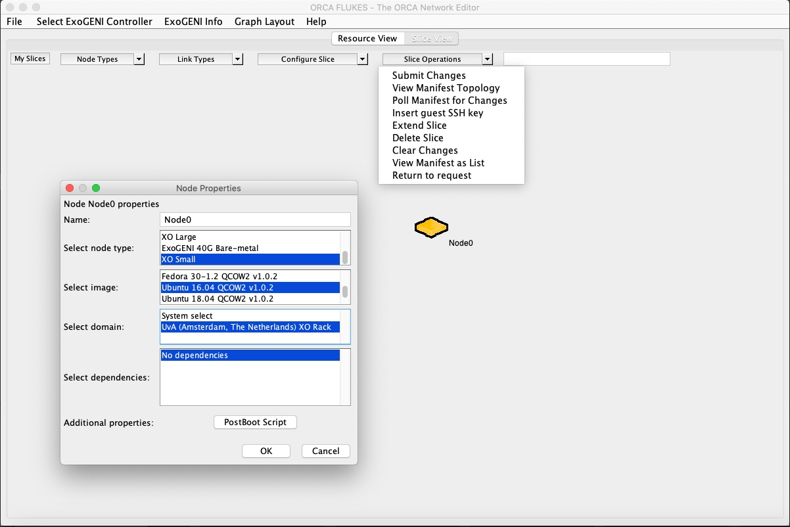
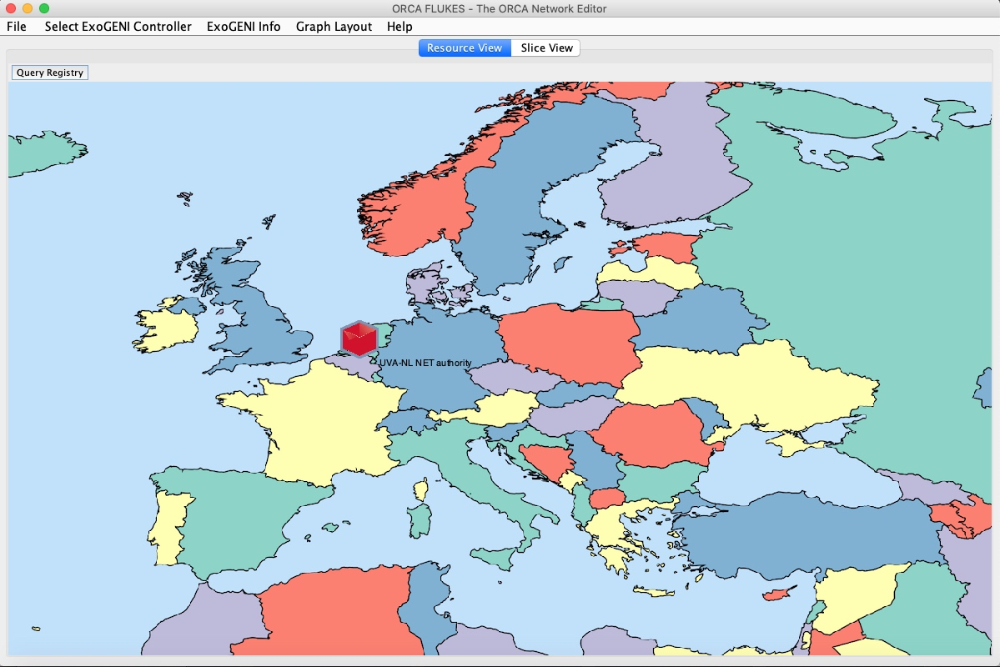
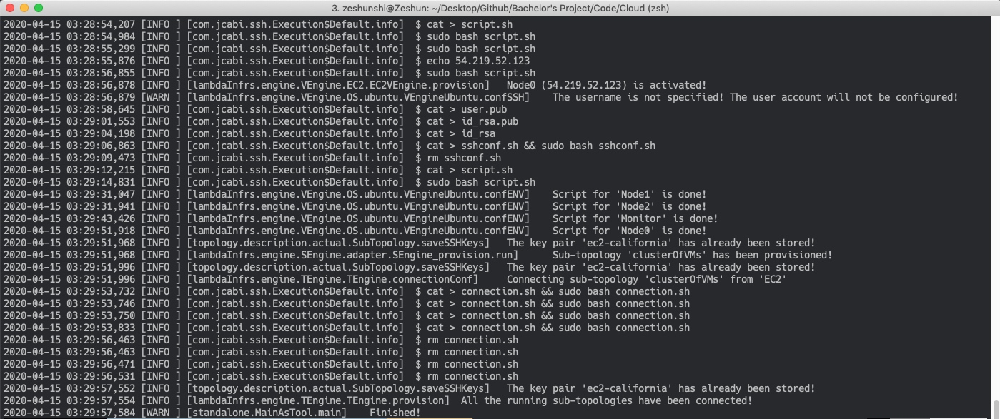
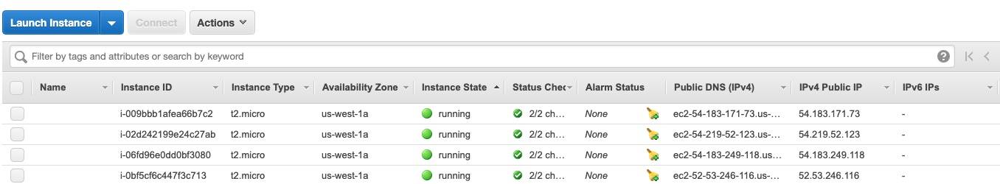

## Automated Blockchain Deployment on Clouds 
There are some automation tools (e.g. Ansible, Cloud-init) on the market which you can use to deploy a blockchian network on Cloud automatically. 

- [Ansible](https://www.ansible.com/)
- [Cloud-init](https://cloudinit.readthedocs.io/en/latest/)
- [CloudsStorm](https://cloudsstorm.github.io/index.html)

In this tutorial, we use CloudsStorm as our automation tool. Before doing the following experiments，please make sure you have read the relevant documents of [CloudsStorm](https://cloudsstorm.github.io/index.html). ExoGENI And Amazon EC2 Were used as the Cloud providers.


### ExoGENI

#### Flukes(optional)
Flukes is ExoGENI's graphical visualization dashboard that can help you use it conveniently. In order to configure your Flukes, first configure your `.flukes.properties` file, change the file path of your pem key.

```
orca.xmlrpc.url=https://geni.renci.org:11443/orca/xmlrpc
user.certfile=/Users/zeshunshi/.ssl/***.pem
user.certkeyfile=/Users/zeshunshi/.ssl/***.pem
enable.modify=true
# SSH Public key to install into VM instances
# ssh.pubkey=~/.ssh/id_dsa.pub
# Secondary login (works with ssh.other.pubkey)
# ssh.other.login=pruth
# Secondary public SSH keys 
# ssh.other.pubkey=~/.ssh/id_dsa.pub
# Should the secondary account have sudo privileges
# ssh.other.sudo=yes
# Path to XTerm executable on your system
xterm.path=/opt/X11/bin/xterm
```
After successful configuration, you can enter the Flukes interface. Here you can select different data centers in the "Select ExoGENI Controller" tab. Click the blank space to build different virtual VMs, instance types, and network topologies.




You can also use "Resource View" tab to check the current usage of each data center.


#### Generate your jks for Cloudsstorm. 
Because cloudsstorm uses the jks key for ExoGENI, you need to generate the corresponding jks file for your SSL.

1. Go to https://portal.geni.net/ and check.
2. Login the NCSA portal and renew the SSL cert.
3. `openssl pkcs12 -export -out eneCert.pkcs12 -in eneCert.pem`  -> gennerate the pkcs file.
4. Using portecle tool to generate a new user.jks file.
5. Modify your `Infs/UC/ExoGENI.yml` file and put the jks key under the same file.


```yaml
userKeyName: ******.jks
keyAlias: ********
keyPassword: ******

```

### Amazon EC2
After registering an Amazon account, you can login your account to check Credentials. 

[Your Security Credentials](https://console.aws.amazon.com/iam/home?#/security_credentials)

After that, change your accessKey/secretKey in the `Infs/UC/EC2.yml` file.
```yaml
accessKey: "********************"
secretKey: "****************************************"
```


### Cloudsstorm
Preliminary preparation: The installation script (bash file) of Blockchain network (each node). Put the following files in the `/Infs/Topology/` folder:
- influxdb.sh (Monior)
- Node0.sh
- Node1.sh
- Node2.sh

Before using Cloudsstorm, you need to configure two files: 1) `clusterOfVMs.yml` defines the virtual machine cluster, and 2) `_top.yml` defines the network topology of the current virtual machine. 
As shown below, `name` represents the name of each virtual machine. `nodeType` is the instance type of the virtual machine, here you can define small, medium, large.`defaultSSHAccount` is the default ssh account (Please note EC2 does not support root direct login). `script` represents the script that needs to be installed on this virtual machine.

```yaml
---
extraInfo:
VMs:
- name: "Node0"
  nodeType: "t2.micro"
  OStype: "Ubuntu 16.04"
  defaultSSHAccount: "ubuntu"
  script: "name@Node0.sh"
- name: "Node1"
  nodeType: "t2.micro"
  OStype: "Ubuntu 16.04"
  defaultSSHAccount: "ubuntu"
  script: "name@Node1.sh"
- name: "Node2"
  nodeType: "t2.micro"
  OStype: "Ubuntu 16.04"
  defaultSSHAccount: "ubuntu"
  script: "name@Node2.sh"
- name: "Monitor"
  nodeType: "t2.micro"
  OStype: "Ubuntu 16.04"
  defaultSSHAccount: "ubuntu"
  script: "name@influxdb.sh"
```
Similarly, we define the topology of the current virtual machine cluster in `_top.yml`. As shown below, we only define one `topology`: clusterOfVMs. `cloudProvider` can choose EC2 or ExoGENI.` domain` can be configured to different data centers. `connections` combines all virtual machines into a subnet with private IP.

```yaml
---
topologies:
- topology: "clusterOfVMs"
  cloudProvider: "EC2"
  domain: "California"
connections:
subnets:
- name: "s1"
  subnet: "192.168.10.0"
  netmask: "24"
  members:
  - vmName: "clusterOfVMs.Monitor"
    address: "192.168.10.5"
  - vmName: "clusterOfVMs.Node0"
    address: "192.168.10.10"
  - vmName: "clusterOfVMs.Node1"
    address: "192.168.10.11"
  - vmName: "clusterOfVMs.Node2"
    address: "192.168.10.12"
```

After the configuration is complete, use the following command to start Cloudsstorm. If no errors are reported, Cloudsstorm will automatically start the virtual machine topology and install all the script of the Sawtooth blockchain.


```bash
java -jar CloudsStorm-b.1.2.jar run ~/Code/Cloud/3_nodes
```



Check your Amazon EC2 dashboard, you will find 4 virtual machines(t2.micro) have been started.



Correspondingly, we can delete the VMs cluster with the following command:
```bash
java -jar CloudsStorm-b.1.2.jar delete ~/Code/Cloud/3_nodes all
```

The log file of the Sawtooth script for each VM will be stored into the `Infs/Topology` path. If the bash installation script is installed incorrectly on the virtual machine, you can query the log through these files.

```
Node0_125742142104353_script.log
Node1_125743037797562_script.log
Node2_125749919208387_script.log
Monitor_125741983063931_script.log
```


### Next step:
- Try to finish the automation workflow of other blockchain platforms. (Test bash script file, recommend Fabric)
- Try to deploy the same blockchain network with different `Cloud Provider`, `Datacenter`, `Instance Type`, `Bandwidth`.
- Benchmark and compare their performance.
