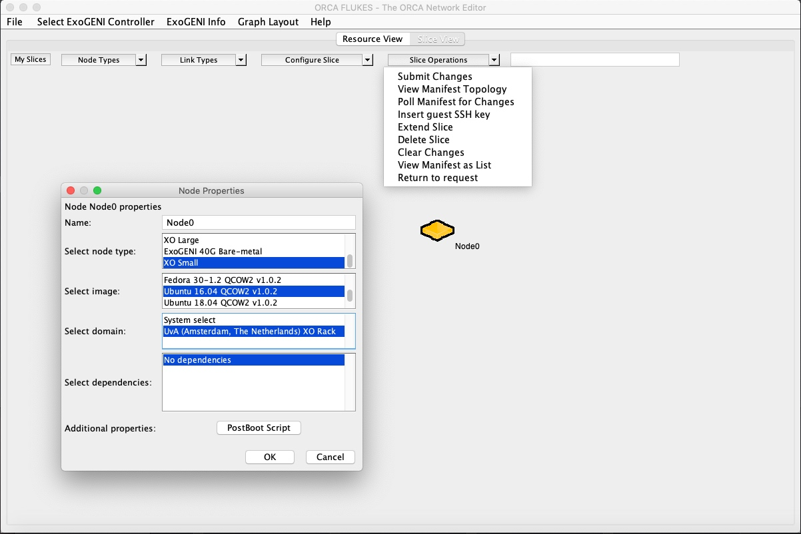
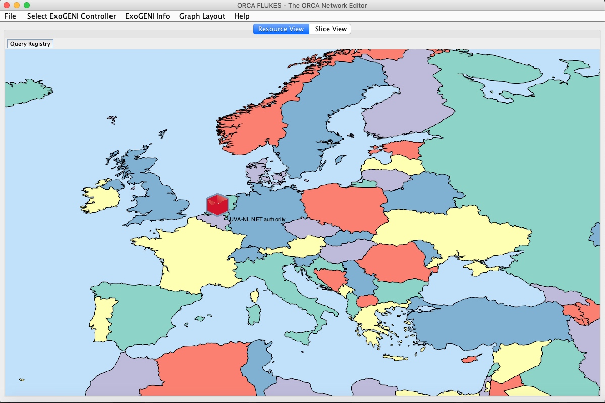
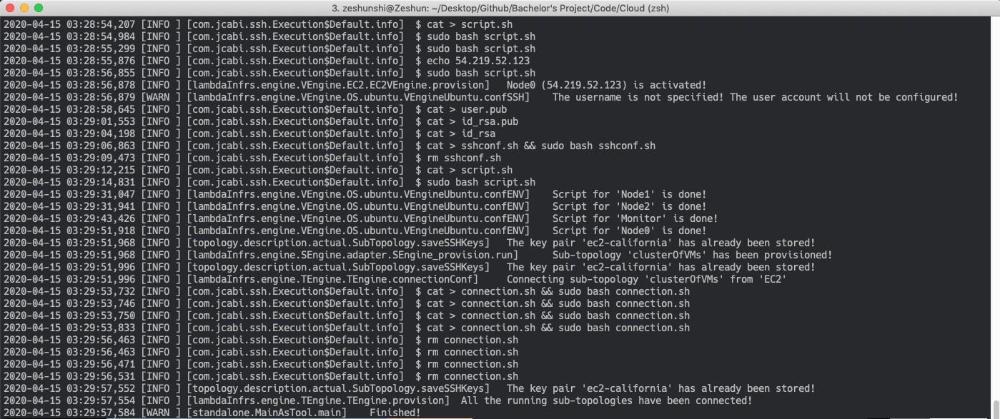
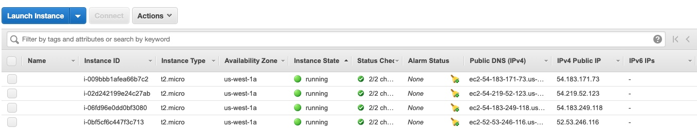

# Blockchain Performance Profiling

This is a tutorial doc for the project "Automated permissioned blockchain performance profiling". The purpose of this doc is to help you get familiar with the basics of cloud virtualized environment and permissioned blockchain quickly: 

1. Learn how to build your Cloud virtualized environment. 
2. Learn how to deploy and benchmark a permissioned blockchain network (Hyperledger Sawtooth).

Table of Contents
=================

- [Tutorial for Bachelor's Project](#tutorial-for-bachelor-s-project)
  * [Build your Cloud virtualized environment](#build-your-cloud-virtualized-environment)
    + [Amazon EC2](#amazon-ec2)
    + [ExoGENI](#exogeni)
  * [Deploy and benchmark a permissioned blockchain (Hyperledger Sawtooth)](#deploy-and-benchmark-a-permissioned-blockchain--hyperledger-sawtooth-)
    + [Introduction](#introduction)
    + [Architecture](#architecture)
    + [Deployment](#deployment)
  * [Exercise](#exercise)

## Build your Cloud virtualized environment

### Amazon EC2 
[Getting Started with Amazon EC2](https://aws.amazon.com/ec2/getting-started/)

The new account has a free tier for 200 hours. However, a credit card is needed.
### ExoGENI
[ExoGENI: Getting Started Tutorial](http://www.exogeni.net/2015/09/exogeni-getting-started-tutorial/)

Tip: Free to use. When applying for an account, choose the organization name with "National Center for Supercomputing Applications". Follow the instruction on the e-mail received after the account has been approved.


You can also try other Cloud providers like:
- [Microsoft Azure](https://azure.microsoft.com/en-gb/)
- [Google Cloud](https://cloud.google.com/)
- [Alibaba](https://us.alibabacloud.com/)

## Deploy and benchmark a permissioned blockchain (Hyperledger Sawtooth)
### Introduction 


Sawtooth was started as a research project of Inter lab in 2014 (Sawtooth Lake). It was donated to Linux foundation in 2016. It’s an enterprise blockchain which aims to provide privacy, security, and scalability service. Characteristics:

- Scalable, highly modular architecture
- Clear separation between network/application layers
- Pluggable consensus algorithms
- Multiple programming language support 

### Architecture
When we build a Hyperledger Sawtooth blockchain network, what do we have?

- The architecture is really simple, basically we have `clients`, `transaction processors`, and `validators`. The client could take several forms, CLIs, GUIs, web-based or browser apps, etc. It created transactions and submit them to the validator nodes. It also just read the values of some state. e.g., Blockchain global state. 
- There are clients, they need to talk to servers. Actually in sawtooth the servers called transaction processors, it's like a clients-servers model. The validator is used to communicate with the clients and transaction processors. 
- Transaction processors were used to capsulate different kinds of business logic. it‘s kind of like the notion of `Smart Contract` in Ethereum and `chain code` in Hyperledger fabric. For example, if you want to use Sawtooth blockchain in a fishing industry scenario, you need to write a fishing transaction processor which include all rules of transactions in your applications.


The client needs to talk to the underlying blockchain network go through a REST service. Validators manage the global state of the blockchain together with other Validators through a P2P network. As you can see from the left bottom of the picture. You use use your favourite programming language to develop your own transaction processors and clients.


### Deployment
Generally, there are 3 methods to install and deploy a Sawtooth blockchain network. In this doc we install it on Linux Ubuntu virtual machine directly (which is the best way to learn). You can also try with Docker-compose or Kubernetes.

Here we want to build a blockchain with 3 nodes. Assuming 4 VMs with Ubuntu 16.04 (small) has been created, their private IP is:
- node0 (192.168.10.10)
- node1 (192.168.10.11)
- node2 (192.168.10.12)
- monitor (192.168.10.5)


In order to build a Hyperledger Sawtooth network，we need to do the following steps in each VM (node0, node1, node2).

1. Add the Sawtooth repository, run these commands in a terminal window on your host system.
2. Update your package lists, then install Sawtooth, telegraf and the consensus engines.
3. Generate your user key for Sawtooth, generate the key for the validator.
4. Configure your validator, restapi, as well as the telegraf.
5. Generate the genesis block in the first node (node0), and start all the services.

The following is an installation bash file of Sawtooth node0 (192.168.10.10).

```BASH
#!/bin/bash
apt-key adv --keyserver hkp://keyserver.ubuntu.com:80 --recv-keys 8AA7AF1F1091A5FD
add-apt-repository 'deb [arch=amd64] http://repo.sawtooth.me/ubuntu/bumper/stable xenial universe'

curl -sL https://repos.influxdata.com/influxdb.key |  sudo apt-key add -
apt-add-repository "deb https://repos.influxdata.com/ubuntu xenial stable"

apt-get update
rm  /var/lib/dpkg/lock

apt-get install -y sawtooth python3-sawtooth-identity
apt-get install -y sawtooth-raft-engine sawtooth-pbft-engine python3-sawtooth-poet-cli python3-sawtooth-poet-engine python3-sawtooth-poet-families
apt-get install -y telegraf

sawtooth keygen
sawadm keygen

chmod -R 777 /var/log/sawtooth/
chmod -R 777 /var/lib/sawtooth/

############configure for validator
cat > /etc/sawtooth/validator.toml << EOF
bind = [
  "network:tcp://192.168.10.10:8800",
  "component:tcp://127.0.0.1:4004",
  "consensus:tcp://127.0.0.1:5050"
]

peering = "static"

endpoint = "tcp://192.168.10.10:8800"

peers = ["tcp://192.168.10.11:8800","tcp://192.168.10.12:8800"]

scheduler = 'parallel'

network_public_key = 'wFMwoOt>yFqI/ek.G[tfMMILHWw#vXB[Sv}>l>i)'
network_private_key = 'r&oJ5aQDj4+V]p2:Lz70Eu0x#m%IwzBdP(}&hWM*'

# The minimum number of peers required before stopping peer search.
minimum_peer_connectivity = 1

# The maximum number of peers that will be accepted.
maximum_peer_connectivity = 100

opentsdb_url = "http://192.168.10.5:8086"
opentsdb_db = "metrics"
opentsdb_username  = "lrdata"
opentsdb_password  = "test"
EOF

############configure for rest_api
cat > /etc/sawtooth/rest_api.toml << EOF
opentsdb_url = "http://192.168.10.5:8086"
opentsdb_db = "metrics"
opentsdb_username  = "lrdata"
opentsdb_password  = "test"
EOF

############configure for telegraf
sed -i '/\[outputs.influxdb\]/a \ \ urls = \[\"http://192.168.10.5:8086\"\]\n  database = \"metrics\"\n  username = \"lrdata\"\n  password = \"test\"' /etc/telegraf/telegraf.conf
sed -i '/\[inputs.system\]/a [[inputs.net]]\n[[inputs.procstat]]\n  exe = \"sawtooth\"\n  prefix = \"sawtooth\"' /etc/telegraf/telegraf.conf

```

Note that when install it on different nodes, you need to modify different IP address. For example, when node1 (192.168.10.11) is installed, the following code needs to be used:

```
network:tcp://192.168.10.11:8800
endpoint = "tcp://192.168.10.11:8800"
peers = ["tcp://192.168.10.10:8800","tcp://192.168.10.12:8800"]
```


Next, configure the Monitor node. You need to install docker, and then use docker to start influxdb (time series database) and grafafa (Visualization & Dashboard).


```bash
#!/bin/bash

curl -fsSL https://download.docker.com/linux/ubuntu/gpg | sudo apt-key add -
add-apt-repository "deb [arch=amd64] https://download.docker.com/linux/ubuntu $(lsb_release -cs) stable"
apt-get update
rm  /var/lib/dpkg/lock
apt-get install -y docker-ce

git clone https://github.com/hyperledger/sawtooth-core.git
docker pull influxdb
docker pull zh9314/sawtooth-stats-grafana

mkdir /var/lib/influx-data

docker run -d -p 8086:8086 -v /var/lib/influx-data:/var/lib/influxdb -e INFLUXDB_DB=metrics -e INFLUXDB_HTTP_AUTH_ENABLED=true -e INFLUXDB_ADMIN_USER=admin -e INFLUXDB_ADMIN_PASSWORD='test' -e INFLUXDB_USER=lrdata -e INFLUXDB_USER_PASSWORD='test' --name sawtooth-stats-influxdb influxdb

docker run -d -p 3000:3000 zh9314/sawtooth-stats-grafana
```

Next, ssh connect to node0, and generate the corresponding genesis block according to different consensus algorithms.


```bash
# generate genesis block (Raft 3 nodes)
sawset genesis --key /etc/sawtooth/keys/validator.priv -o config-genesis.batch
sawset proposal create --key /etc/sawtooth/keys/validator.priv -o config-consensus.batch sawtooth.consensus.algorithm.name=raft sawtooth.consensus.algorithm.version=0.1.1 sawtooth.consensus.raft.peers=[\"$(ssh root@192.168.10.10 "cat /etc/sawtooth/keys/validator.pub")\",\"$(ssh root@192.168.10.11 "cat /etc/sawtooth/keys/validator.pub")\",\"$(ssh root@192.168.10.12 "cat /etc/sawtooth/keys/validator.pub")\"]
sawset proposal create --key /etc/sawtooth/keys/validator.priv -o raft-settings.batch sawtooth.consensus.raft.heartbeat_tick=2 sawtooth.consensus.raft.election_tick=20 sawtooth.consensus.raft.period=3500
sawadm genesis config-genesis.batch config-consensus.batch raft-settings.batch
```

Note that `sawtooth.consensus.raft.peers` should be a list of validator public key in the network. Which can be achieved in the `/etc/sawtooth/keys/validator.pub` folder.

Other parameters of raft consensus algorithm can be configured, such as `consensus.raft.heartbeat_tick` and `sawtooth.consensus.raft.election_tick`.

After generating the genesis block, ssh connect to each node and start all the sawtooth related service:
```bash
# start all the service (Raft 3 nodes)
for (( i=0; i <= 2; i++ ))
do
    ssh root@Node$i "systemctl start sawtooth-rest-api.service"
    ssh root@Node$i "systemctl start sawtooth-settings-tp.service"
    ssh root@Node$i "systemctl start sawtooth-identity-tp.service"
    ssh root@Node$i "systemctl start sawtooth-intkey-tp-python.service"
    ssh root@Node$i "systemctl start sawtooth-validator.service"
    ssh root@Node$i "systemctl start sawtooth-raft-engine.service"
    sleep 10
done
```

Similarly, the codes of the PBFT and PoET consensus algorithms are:
```bash
///PBFT
# generate genesis block (PBFT 5 nodes)
sawset genesis --key /etc/sawtooth/keys/validator.priv -o config-genesis.batch
sawset proposal create --key /etc/sawtooth/keys/validator.priv -o config-consensus.batch sawtooth.consensus.algorithm.name=pbft sawtooth.consensus.algorithm.version=1.0 sawtooth.consensus.pbft.members=[\"$(ssh root@192.168.10.10 "cat /etc/sawtooth/keys/validator.pub")\",\"$(ssh root@192.168.10.11 "cat /etc/sawtooth/keys/validator.pub")\",\"$(ssh root@192.168.10.12 "cat /etc/sawtooth/keys/validator.pub")\",\"$(ssh root@192.168.10.13 "cat /etc/sawtooth/keys/validator.pub")\",\"$(ssh root@192.168.10.14 "cat /etc/sawtooth/keys/validator.pub")\"]
sawset proposal create --key /etc/sawtooth/keys/validator.priv -o pbft-settings.batch sawtooth.consensus.pbft.block_publishing_delay=1000 sawtooth.consensus.pbft.commit_timeout=10000 sawtooth.consensus.pbft.forced_view_change_interval=100 sawtooth.consensus.pbft.idle_timeout=30000 sawtooth.consensus.pbft.view_change_duration=5000
sawadm genesis config-genesis.batch config-consensus.batch pbft-settings.batch
# start all the service (PBFT 5 nodes)
for (( i=0; i <= 4; i++ ))
do
    ssh root@Node$i "systemctl start sawtooth-rest-api.service"
    ssh root@Node$i "systemctl start sawtooth-settings-tp.service"
    ssh root@Node$i "systemctl start sawtooth-identity-tp.service"
    ssh root@Node$i "systemctl start sawtooth-intkey-tp-python.service"
    ssh root@Node$i "systemctl start sawtooth-validator.service"
    ssh root@Node$i "systemctl start sawtooth-pbft-engine.service"
    sleep 10
done
```


```bash
# generate genesis block (PoET 5 nodes)

sawset genesis --key /etc/sawtooth/keys/validator.priv -o config-genesis.batch
sawset proposal create --key /etc/sawtooth/keys/validator.priv -o config-consensus.batch sawtooth.consensus.algorithm.name=PoET sawtooth.consensus.algorithm.version=0.1 sawtooth.poet.report_public_key_pem="$(cat /etc/sawtooth/simulator_rk_pub.pem)" sawtooth.poet.valid_enclave_measurements=$(poet enclave measurement) sawtooth.poet.valid_enclave_basenames=$(poet enclave basename)
poet registration create --key /etc/sawtooth/keys/validator.priv -o poet.batch
sawset proposal create --key /etc/sawtooth/keys/validator.priv -o poet-settings.batch sawtooth.poet.target_wait_time=5 sawtooth.poet.initial_wait_time=25 sawtooth.publisher.max_batches_per_block=100
sawadm genesis config-genesis.batch config-consensus.batch poet.batch poet-settings.batch

chmod -R 777 /var/log/sawtooth/
chmod -R 777 /var/lib/sawtooth/

# start all the service (PoET 5 nodes)
for (( i=0; i <= 4; i++ ))
do
    ssh root@Node$i "systemctl start sawtooth-rest-api.service"
    ssh root@Node$i "systemctl start sawtooth-settings-tp.service"
    ssh root@Node$i "systemctl start sawtooth-identity-tp.service"
    ssh root@Node$i "systemctl start sawtooth-intkey-tp-python.service"
    ssh root@Node$i "systemctl start sawtooth-validator.service"
    ssh root@Node$i "systemctl start sawtooth-poet-validator-registry-tp.service"
    ssh root@Node$i "systemctl start sawtooth-poet-engine.service"
    ssh root@Node$i "systemctl restart telegraf"
    sleep 10
done
```


Now, your blockchain network is ready to use. Go to the following link to reach your Grafana dashboard.
`http://<YourMonitorNodePublicIP>:3000/`


```
User: admin
Password: admin
```


Configure InfludDB Data Source


HTTP settings tab:
`URL: http://192.168.10.5:8086`


InfluxDB Details:

```
Database:metrics
User:lrdata
Password:test
```

Go to node0 and submit a transaction request with [intkey](https://sawtooth.hyperledger.org/docs/core/releases/1.0/cli/intkey.html) transaction processor. The following command indicates that the workload is generated at the input rate of 10tps, it is displayed in the terminal every 10s, and the total execution time is 60 seconds. From the Grafana dashboard we can see that the block number, block committed, committed transaction tab has changed corresponding.


`timeout 60 intkey workload --rate 10 -d 10`


## Exercise

Now you can start a Sawtooth blockchain by yourself. The real-time monitoring data of the blcokchain has been stored in a time series database (Influxdb). Try following:
- play with more Sawtooth nodes
- play with different consensus algorithms
- play with different blockchain settings
- play with different Clouds (providers, datacenters, VM instance type)


## Automated Blockchain Deployment on Clouds 
There are some automation tools (e.g. Ansible, Cloud-init) on the market which you can use to deploy a blockchian network on Cloud automatically. 

- [Ansible](https://www.ansible.com/)
- [Cloud-init](https://cloudinit.readthedocs.io/en/latest/)
- [CloudsStorm](https://cloudsstorm.github.io/index.html)

In this tutorial, we use CloudsStorm as our automation tool. Before doing the following experiments，please make sure you have read the relevant documents of [CloudsStorm](https://cloudsstorm.github.io/index.html). ExoGENI And Amazon EC2 Were used as the Cloud providers.


### ExoGENI

#### Flukes(optional)
Flukes is ExoGENI's graphical visualization dashboard that can help you use it conveniently. In order to configure your Flukes, first configure your `.flukes.properties` file, change the file path of your pem key.

```
orca.xmlrpc.url=https://geni.renci.org:11443/orca/xmlrpc
user.certfile=/Users/zeshunshi/.ssl/***.pem
user.certkeyfile=/Users/zeshunshi/.ssl/***.pem
enable.modify=true
# SSH Public key to install into VM instances
# ssh.pubkey=~/.ssh/id_dsa.pub
# Secondary login (works with ssh.other.pubkey)
# ssh.other.login=pruth
# Secondary public SSH keys 
# ssh.other.pubkey=~/.ssh/id_dsa.pub
# Should the secondary account have sudo privileges
# ssh.other.sudo=yes
# Path to XTerm executable on your system
xterm.path=/opt/X11/bin/xterm
```
After successful configuration, you can enter the Flukes interface. Here you can select different data centers in the "Select ExoGENI Controller" tab. Click the blank space to build different virtual VMs, instance types, and network topologies.




You can also use "Resource View" tab to check the current usage of each data center.


#### Generate your jks for Cloudsstorm. 
Because cloudsstorm uses the jks key for ExoGENI, you need to generate the corresponding jks file for your SSL.

1. Go to https://portal.geni.net/ and check.
2. Login the NCSA portal and renew the SSL cert.
3. `openssl pkcs12 -export -out eneCert.pkcs12 -in eneCert.pem`  -> gennerate the pkcs file.
4. Using portecle tool to generate a new user.jks file.
5. Modify your `Infs/UC/ExoGENI.yml` file and put the jks key under the same file.


```yaml
userKeyName: ******.jks
keyAlias: ********
keyPassword: ******

```

### Amazon EC2
After registering an Amazon account, you can login your account to check Credentials. 

[Your Security Credentials](https://console.aws.amazon.com/iam/home?#/security_credentials)

After that, change your accessKey/secretKey in the `Infs/UC/EC2.yml` file.
```yaml
accessKey: "********************"
secretKey: "****************************************"
```


### Cloudsstorm
Preliminary preparation: The installation script (bash file) of Blockchain network (each node). Put the following files in the `/Infs/Topology/` folder:
- influxdb.sh (Monior)
- Node0.sh
- Node1.sh
- Node2.sh

Before using Cloudsstorm, you need to configure two files: 1) `clusterOfVMs.yml` defines the virtual machine cluster, and 2) `_top.yml` defines the network topology of the current virtual machine. 
As shown below, `name` represents the name of each virtual machine. `nodeType` is the instance type of the virtual machine, here you can define small, medium, large.`defaultSSHAccount` is the default ssh account (Please note EC2 does not support root direct login). `script` represents the script that needs to be installed on this virtual machine.

```yaml
---
extraInfo:
VMs:
- name: "Node0"
  nodeType: "t2.micro"
  OStype: "Ubuntu 16.04"
  defaultSSHAccount: "ubuntu"
  script: "name@Node0.sh"
- name: "Node1"
  nodeType: "t2.micro"
  OStype: "Ubuntu 16.04"
  defaultSSHAccount: "ubuntu"
  script: "name@Node1.sh"
- name: "Node2"
  nodeType: "t2.micro"
  OStype: "Ubuntu 16.04"
  defaultSSHAccount: "ubuntu"
  script: "name@Node2.sh"
- name: "Monitor"
  nodeType: "t2.micro"
  OStype: "Ubuntu 16.04"
  defaultSSHAccount: "ubuntu"
  script: "name@influxdb.sh"
```
Similarly, we define the topology of the current virtual machine cluster in `_top.yml`. As shown below, we only define one `topology`: clusterOfVMs. `cloudProvider` can choose EC2 or ExoGENI.` domain` can be configured to different data centers. `connections` combines all virtual machines into a subnet with private IP.

```yaml
---
topologies:
- topology: "clusterOfVMs"
  cloudProvider: "EC2"
  domain: "California"
connections:
subnets:
- name: "s1"
  subnet: "192.168.10.0"
  netmask: "24"
  members:
  - vmName: "clusterOfVMs.Monitor"
    address: "192.168.10.5"
  - vmName: "clusterOfVMs.Node0"
    address: "192.168.10.10"
  - vmName: "clusterOfVMs.Node1"
    address: "192.168.10.11"
  - vmName: "clusterOfVMs.Node2"
    address: "192.168.10.12"
```

After the configuration is complete, use the following command to start Cloudsstorm. If no errors are reported, Cloudsstorm will automatically start the virtual machine topology and install all the script of the Sawtooth blockchain.


```bash
java -jar CloudsStorm-b.1.2.jar run ~/Code/Cloud/3_nodes
```



Check your Amazon EC2 dashboard, you will find 4 virtual machines(t2.micro) have been started.



Correspondingly, we can delete the VMs cluster with the following command:
```bash
java -jar CloudsStorm-b.1.2.jar delete ~/Code/Cloud/3_nodes all
```

The log file of the Sawtooth script for each VM will be stored into the `Infs/Topology` path. If the bash installation script is installed incorrectly on the virtual machine, you can query the log through these files.

```
Node0_125742142104353_script.log
Node1_125743037797562_script.log
Node2_125749919208387_script.log
Monitor_125741983063931_script.log
```


## Next step:
- Try to finish the automation workflow of other blockchain platforms. (Test bash script file, recommend Fabric)
- Try to deploy the same blockchain network with different `Cloud Provider`, `Datacenter`, `Instance Type`, `Bandwidth`.
- Benchmark and compare their performance.

